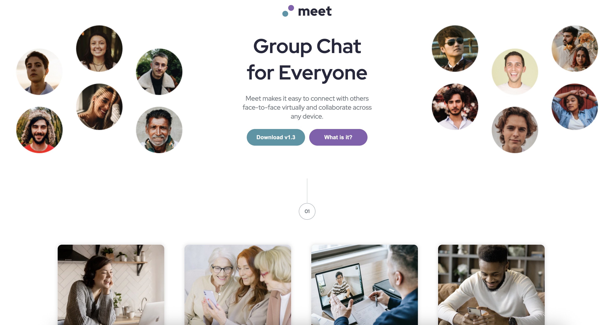

# Frontend Mentor - Meet landing page solution

This is a solution to the [Meet landing page challenge on Frontend Mentor](https://www.frontendmentor.io/challenges/meet-landing-page-rbTDS6OUR). Frontend Mentor challenges help you improve your coding skills by building realistic projects.

## Table of contents

- [Overview](#overview)
  - [The challenge](#the-challenge)
  - [Screenshot](#screenshot)
  - [Links](#links)
- [My process](#my-process)
  - [Built with](#built-with)
  - [What I learned](#what-i-learned)

## Overview

### The challenge

Users should be able to:

- View the optimal layout depending on their device's screen size
- See hover states for interactive elements

### Screenshot

#### tablet view

#### mobile view

### Links

- Solution URL: https://github.com/SurajChaunal/frontend-mentor-meet-page.git
- Live Site URL: https://surajchaunal.github.io/frontend-mentor-meet-page/

## My process

### Built with

- Semantic HTML5 markup
- CSS custom properties
- Flexbox
- CSS Grid
- Desktop first development
- Full page layout
- Advanced Techniques
- Media quries

**Note: These are just examples. Delete this note and replace the list above with your own choices**

### What I learned

Built a fully responsive full page layout for using both flexbox and grid, responsive image, media queries.
